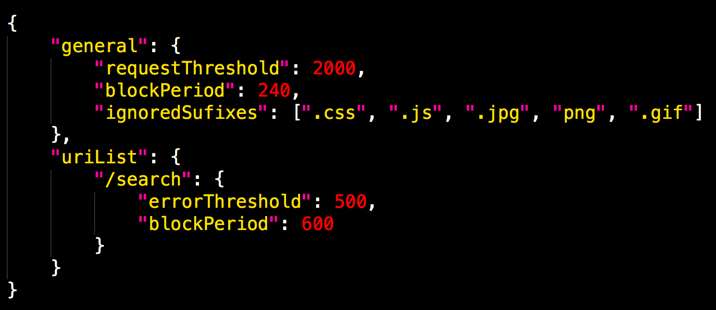

# Step 2 - Customising and extending AWS WAF Security Automations Solution


## 2.1.1 Customise HTTP Flood Protection (AWS Lambda Log Parser)

The HTTP Flood log parser comes with some extensions points, they are:

* Request Threshold: the maximum acceptable requests per five minutes per IP address.
* Block Period: the period (in minutes) to block applicable IP addresses.
* Ignored Suffixes: requests accessing this type of resource will not count to request threshold. By default, this list is empty.
* URI List: use this to define a custom request threshold and block period for specifics URLs. By default, this list is empty.

The goal now is to apply customizations and check how it affects the log parser behavior. 


### 2.1.2 Customising the Parser

* Go to the S3 bucket used for WAF Logs Bucket. To check it's name, go to stack's Outputs tab and search for the value defined for WafLogBucket;
* Download the configuration file `<stack_name>-waf_log_conf.json`;
* Make your changes (ex: change requestThreshold to 100);
* Overwrite the configuration file on S3 bucket by uploading the new `<stack_name>-waf_log_conf.json` back to WAF Logs Bucket.

Here is a sample of changed file:




### 2.1.3 Testing the new rules
Let's test your HTTP flood protection. We will use [Apache AB](https://httpd.apache.org/docs/2.4/programs/ab.html).

> ⚠️ **Warning**: Do not run the benchmarking tool from your local machine!

We will use [Systems Manager Session Manager](https://console.aws.amazon.com/systems-manager/session-manager/start-session) to connect to the instance and run the `ab` benchmarking tool.

Run against your endpoint 50,000 requests, with concurrency 100.
```bash
# Note the trailing slash
ab -n 50000 -c 100 <your-endpoint>/
```

* After a couple of minutes (time necessary to ALB deliver the access logs to S3), go to AWS WAF console and check if HTTP Flood rule contains your EC2 instance IP listed.

* Try to access <your-endpoint> from the instance you've sent the requests:
```bash
curl -s -o /dev/null -w "Return Code: %{http_code}\n" <your-endpoint>
```

## 2.2 Customising Scanners and Probes


Now we will customise our Scanner and Probe rules. These use Amazon Athena.
The solutions refer to the Athena by a saved query ID. As Athena don't allow you to change saved queries, the process to apply customizations to Athena query is by creating a new query and updating the Athena log parser event to use the new query ID.

### 2.2.1
* Navigate to the Amazon Athena console, select the Saved Queries tab;
* Select the query you want to customize (ScannersProbesLogParser);


* Apply your changes (ex: change from COUNT(*)>=50 to COUNT(*)>=500);
* Save the new Athena Query and copy the new query ID.


> NOTE: The query ID is part of the URL when you access the saved query (https://console.aws.amazon.com/athena/home?force#query/saved/**_query_id_**). Alternatively, you can use the `get-named-query CLI command`;


* Navigate to LogParser events and select the corresponding event (ScannerProbe);


* Edit the event data to point to the new Query ID copied above;


Save the new event data;

The Log Parser will now process logs using your new Athena Query.

Done? Great work! Continue to the last challenge
# [Next step](step-3.md)
